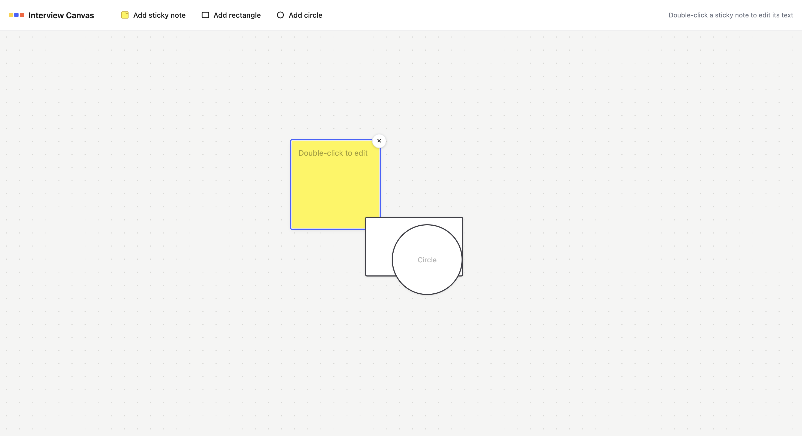
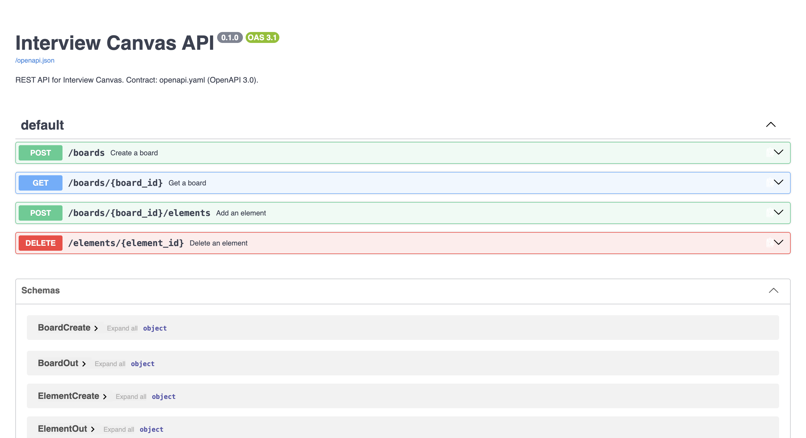

# Interview Canvas


[](https://github.com/DataTalksClub/ai-dev-tools-zoomcamp)

Collaborative whiteboard for system design interviews: sticky notes and basic
shapes on a shared board. This is the Module 2 deliverable — a full-stack app
that runs locally: a static frontend and a FastAPI backend talking over an
OpenAPI contract, with data persisted in SQLite.

## Repository layout

```text
product-spec.md          product requirements (user stories, acceptance criteria, non-goals)
AGENTS.md                project conventions and commands for agents
openapi.yaml             API contract (source of truth)
frontend/                plain HTML/CSS/JS prototype (no build step)
backend/                 FastAPI app (main, routes, services, models, schemas, database)
tests/                   pytest (backend) + node:test (frontend)
docs/                    screenshots and the AI usage report
```

## Prerequisites

- [uv](https://docs.astral.sh/uv/) — manages the Python environment
  (downloads a managed Python 3.11+ automatically if the system one is older)
- A browser — the frontend is plain HTML/CSS/JS
- Node.js 18+ — only needed for the frontend tests

## Run locally

Start the backend (from the repo root):

```bash
uv run uvicorn backend.main:app --reload
```

- API: http://localhost:8000
- Interactive docs (Swagger UI): http://localhost:8000/docs
- Machine-readable contract: http://localhost:8000/openapi.json

The SQLite file `db.sqlite3` is created in the repo root on first start
(it is gitignored).

Open the frontend — either directly from disk or via a tiny static server:

```bash
# Option A: double-click / open frontend/index.html in a browser
open frontend/index.html

# Option B: static server
python3 -m http.server 8123 -d frontend   # then open http://localhost:8123
```

On page load the frontend creates a new board (`POST /boards`) and renders its
elements; elements are added/deleted through the API and the board is reloaded
after every mutation.

## Screenshots

The board — sticky notes and shapes created through the real API:



Interactive API docs generated by FastAPI at `/docs`:



## Tests

Backend (unit + API integration):

```bash
uv run pytest
```

Frontend (contract behavior of `app.js` in jsdom):

```bash
npm install   # once
npm test
```

## Configuration

| Variable | Default | Purpose |
|----------|---------|---------|
| `DATABASE_URL` | `sqlite:///./db.sqlite3` | SQLAlchemy connection string. Set to a Postgres URL to swap databases without code changes (install the matching driver, e.g. `psycopg`) |

## How it was built (AI-native full-stack workflow)

This project follows the AI-native development workflow from the
[AI Dev Tools Zoomcamp 2026](https://github.com/DataTalksClub/ai-dev-tools-zoomcamp):

1. **Spec first** – `product-spec.md` defines user stories, acceptance criteria,
   and non-goals before any code.
2. **Frontend prototype** – a plain HTML/CSS/JS prototype with mocked state was
   built to validate UX.
3. **OpenAPI contract** – `openapi.yaml` was created as the single source of truth
   between frontend and backend.
4. **Backend implementation** – FastAPI + SQLAlchemy were implemented strictly
   against the contract, with SQLite persistence and a database-agnostic design
   (`DATABASE_URL`).
5. **Testing** – unit and integration tests (pytest) cover the backend; frontend
   logic is tested with jsdom + node:test.
6. **Integration** – the frontend was switched from mocks to real API calls, with
   CORS and error handling.
7. **Context engineering** – `AGENTS.md` provides commands and rules for AI coding
   agents.
8. **AI usage report** – `docs/ai-usage-report.md` documents prompts, bugs,
   lessons, and the split between AI and human contributions.

All steps were verified by running the app locally and passing both test suites.

📚 Course materials and module requirements: [Module 2 README](https://github.com/DataTalksClub/ai-dev-tools-zoomcamp/blob/main/02-development/README.md)

## API contract

`openapi.yaml` is the source of truth for the API. The backend implements it
exactly; FastAPI's generated `/openapi.json` mirrors the same four endpoints:

- `POST /boards` — create a board
- `GET /boards/{board_id}` — get a board with all elements
- `POST /boards/{board_id}/elements` — add an element (sticky_note / rectangle / circle)
- `DELETE /elements/{element_id}` — delete an element
